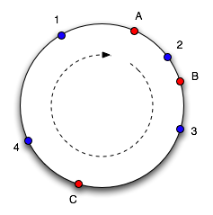
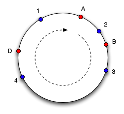

# Consistent Hashing

Consistent hashing is a special kind of hashing such that when a hash table is re-sized and consistent hashing is used, only `k/n` keys need to be remapped on average, where `k` is the number of keys, and `n` is the number of slots. In contrast, in most traditional hash tables, a change in the number of array slots causes nearly all keys to be remapped.

## The Rehashing problem
If you have n cache servers, a common way to balance the load is to use the following hash method:
`serverIndex = hash(key) % N` where N is the size of the server pool.

- This works until you need to scale. If you have 4 servers and add 1 more `n=5`:
  - Almost every key's mapping changes `hash(key) % 4` vs `hash(key) % 5`. For e.g., `hash(key0) => 151011 % 4 => 3` while `hash(key0) => 151011 % 5 => 1`.
  - In a caching layer, this triggers a **cache stampede** because suddenly 80-90% of your keys are "missing" from their new assigned servers.
  - In a database, you’d have to migrate nearly all your data across the network.
- Consistent hashing ensures that when a node is added or removed, only `K/n` keys need to be remapped (where `K` is the total number of keys).


> **With simple hashing, when a new server is added, almost all the keys need to be remapped. With consistent hashing, adding a new server only requires redistribution of a fraction of the keys**

# 🚀 Consistent Hashing: High-Performance Distributed Scaling

[Intro to Consistent Hashing by Tom White](https://tom-e-white.com/2007/11/consistent-hashing.html)

## 📖 Overview

- Consistent hashing is a key‑distribution technique where both nodes (caches/servers) and keys (objects) are mapped into the same hash space so that adding or removing a node only remaps a small fraction of keys instead of almost all of them. 
- Consistent hashing is a distribution strategy that allows for horizontal scaling of distributed systems (Caches, NoSQL DBs, Load Balancers) with minimal data movement. Unlike standard modulo hashing, which causes a "global reshuffle" when nodes are added or removed, consistent hashing ensures that only **** keys are remapped.
- The basic idea behind the consistent hashing algorithm is to hash both objects and caches using the same hash function. The reason to do this is to map the cache to an interval, which will contain a number of object hashes. If the cache is removed then its interval is taken over by a cache with an adjacent interval. All the other caches remain unchanged.

### 🍕 The "Pizza Slice" Analogy

Imagine the hash space as a giant circular pizza.

* **Physical Nodes:** These are "cutters" placed at random points on the pizza edge.
* **Keys (Data):** These are "toppings" placed on the pizza. A topping belongs to the first cutter you hit moving **clockwise**.
* **Virtual Nodes:** Instead of 3 big cutters, we use 300 tiny ones. If one cutter is removed, its toppings are distributed among *many* other cutters, not just one neighbor.

### Hash ring / circle idea

- The hash function maps objects and caches into an integer range (e.g., Java int), which is conceptually wrapped into a circle, forming a ring.
- Each cache node appears as one or more points on this ring; to locate an object, you hash the object and move clockwise on the ring until you hit the first node point, and that node owns the object
- If a node is removed, only the objects whose hash fell in that node’s segment move (to the next node on the ring); if a node is added, it takes over just the objects in its new segment from its neighbors



- To find which cache an object goes in, we move clockwise round the circle until we find a cache point. So in the diagram above, we see object 1 and 4 belong in cache A, object 2 belongs in cache B and object 3 belongs in cache C. Consider what happens if cache C is removed: object 3 now belongs in cache A, and all the other object mappings are unchanged. If then another cache D is added in the position marked it will take objects 3 and 4, leaving only object 1 belonging to A.



- This works well, except the size of the intervals assigned to each cache is pretty hit and miss. Since it is essentially random it is possible to have a very non-uniform distribution of objects between caches. The solution to this problem is to introduce the idea of "virtual nodes", which are replicas of cache points in the circle. So whenever we add a cache we create a number of points in the circle for it.

## 🛠 Python Implementation Example
```python
import hashlib
import bisect
import mmh3

class ConsistentHashRing:
    def __init__(self, nodes=None, vnodes=100):
        """
        Initializes the hash ring.
        :param nodes: List of physical node names (e.g., ['server-1', 'server-2'])
        :param vnodes: Number of virtual nodes per physical node to ensure uniform distribution.
        """
        self.vnodes = vnodes
        
        # This list stores the sorted hash values of all virtual nodes (the 'Ring').
        self.ring = []        
        
        # Map to link a specific hash value back to the actual physical node name.
        self.nodes_map = {}   

        # If an initial list of nodes is provided, populate the ring immediately.
        if nodes:
            for node in nodes:
                self.add_node(node)

    # def _hash(self, key):
        # """
        # Generates a 128-bit integer hash for a given string key.
        # We use MD5 for stability across different processes/restarts.
        # """
        # return int(hashlib.md5(key.encode('utf-8')).hexdigest(), 16)

    def _hash(self, key):
        # mmh3.hash returns a 32-bit integer by default. 
        # It's non-cryptographic, lightning fast, and has high entropy.
        return mmh3.hash(key)

    def add_node(self, node_name):
        """
        Places a physical node on the ring by creating multiple virtual nodes (vnodes).
        """
        for i in range(self.vnodes):
            # Create a unique string for each virtual node (e.g., "server-1#0", "server-1#1")
            vnode_key = f"{node_name}#{i}"
            h = self._hash(vnode_key)
            
            # bisect.insort maintains the list in sorted order (O(N) complexity for insertion).
            # This is efficient for setup/config changes, but lookups remain fast.
            bisect.insort(self.ring, h)
            
            # Store the mapping from the hash back to the physical node.
            self.nodes_map[h] = node_name

    def remove_node(self, node_name):
        """
        Removes all virtual nodes associated with a physical node.
        (Added this for completeness as it's vital for a dynamic system).
        """
        for i in range(self.vnodes):
            h = self._hash(f"{node_name}#{i}")
            # Find and remove the hash from the ring and the mapping.
            idx = bisect.bisect_left(self.ring, h)
            if idx < len(self.ring) and self.ring[idx] == h:
                self.ring.pop(idx)
                del self.nodes_map[h]

    def get_node(self, key):
        """
        Determines which physical node a specific key (e.g., user_id) belongs to.
        """
        if not self.ring:
            return None
        
        # 1. Hash the incoming key to find its position on the ring.
        h = self._hash(key)
        
        # 2. Use binary search (O(log N)) to find the first virtual node hash
        # that is greater than or equal to the key's hash.
        idx = bisect.bisect_left(self.ring, h)
        
        # 3. If the index is equal to the length of the ring, it means the key's hash
        # is larger than the largest hash in the ring. Because it's a 'ring',
        # we wrap around to the first node (index 0).
        idx = idx % len(self.ring)
        
        # 4. Return the physical node name associated with that hash.
        return self.nodes_map[self.ring[idx]]
```
#### Code Review & Feedback
- Hash Choice: You correctly avoided Python's built-in hash() function, which is salted and non-deterministic across sessions. We used MurmurHash3 because it is industry standard for non-crypto stuff.
- Virtual Nodes: Your use of vnodes is crucial. Without them, nodes are unevenly distributed on the ring, leading to "hotspots.
- "Efficiency: Using bisect.insort maintains the ring in a sorted state, allowing for $O(\log N)$ lookups via binary search.

#### Why MurmurHash3 is the "Industry Standard" ?
If you are building infrastructure for AI training or blockchain node discovery, MurmurHash3 (or the newer XXHash) is usually the winner.
- Speed: It is significantly faster than MD5 or SHA because it doesn't try to be "un-hackable."
- **Avalanche Effect**: It has a great "avalanche effect"—changing one bit in the input changes about 50% of the bits in the hash. This is exactly what prevents "hotspots" on your hash ring.

## 🏗 System Design Deep Dive

### How did we find the imbalance in distribution of keys among servers ?

Suppose first set of 10 cache nodes hold these numbers of keys: `[900, 1050, 980, 1010, 875, 1120, 950, 1025, 1085, 1005]`

second set of 10 cache nodes hold these numbers of keys: `[10, 20, 30, 40, 50, 100, 200, 300, 400, 8850]`

- Step 1: Mean
    - Mean (average) load = 1000 keys per node for both set.
    - Insight: scale and target. This tells you the typical load; if you add a new node, you want it to get roughly 1000 keys to be “fair.”
- Step 2: Standard deviation
    - Standard deviation (population) for these 10 values is about 73.1 keys.
    - As a percentage of the mean, that is `73.1/1000~7.3%` and for second set the std is `2619.7 keys` or `~262%` which is highly imbalanced.

### 1. Why Virtual Nodes (VNodes)?

* **Uniformity:** Prevents "hot spots" where one server owns a disproportionate slice of the ring.
* **Heterogeneity:** You can give powerful servers more VNodes (higher `weight`) to handle more traffic.
* **Blast Radius:** If a node fails, its load is spread across the *entire* remaining cluster.

### 2. The Replication Strategy 🛡️

In production (e.g., Cassandra or DynamoDB), we don't just store data on *one* node. We store it on the first  distinct nodes encountered clockwise on the ring. This ensures **High Availability**.

### 3. Edge Case: The "Wrap-Around"

If a key's hash is higher than the highest VNode hash, it "wraps around" to the first VNode at the start of the ring (index 0).


## 📚 Industry Standards

| Category | Names to Know |
| --- | --- |
| **Algorithms** | **Ketama** (used by Nginx/Memcached), **Jump Consistent Hash** (Google) |
| **Python Libs** | `uhashring` (standard), `sortedcontainers` (for custom high-speed rings) |
| **Systems** | **Amazon DynamoDB**, **Apache Cassandra**, **Akamai CDN**, **Discord** |

## ⚠️ Critical Things to Remember

1. **Deterministic Hashing:** Ensure all clients use the *exact same* hash algorithm and seed.
2. **Node Flapping:** Rapidly adding/removing nodes can cause "thrashing." Use a **Gossip Protocol** or centralized coordinator (Zookeeper/Etcd) to sync the ring state.
3. **Cascading Failures:** Without VNodes, a single node failure can double the load on its immediate neighbor, potentially killing it and starting a domino effect.

# Why hotspots in distributed systems are bad ?

In a distributed system, a "hotspot" is essentially a traffic jam 🚦 caused by an uneven distribution of data or requests. When one section of your hash ring is "busier" than others, it means one physical server is doing significantly more work than its peers.

### 🌑 The Dark Effects of Hotspots

- Resource Exhaustion (The "Silent Killer"): If Shard A is a hotspot, its CPU 🧠 and RAM 💾 will redline while Shard B sits idle. Even if your cluster has enough total capacity, the system fails because one node hits its limit. This leads to increased latency 🐢 and eventually "Connection Timeout" errors for your users.
- The "Thundering Herd" on Failure: If a hotspot server crashes because it's overwhelmed, all that heavy traffic immediately shifts clockwise to the next server. If that neighbor was already busy, it will likely crash too, creating a Cascading Failure 💣 that can take down your entire database cluster.
- Inefficient Scaling (Wasted Money) 💸: You might see high latency and think, "I need more servers!" But if 90% of your traffic is hitting one node, adding 10 more nodes won't help unless the hash ring is balanced. You end up paying for idle hardware while your app still feels slow.

### 🔍 Understanding the "Why"

> In a high-pace startup (especially in finance or computing), we want Predictable Performance. We want to know that if we have 10 servers, each is handling ~10% of the load. Hotspots make the system unpredictable.

